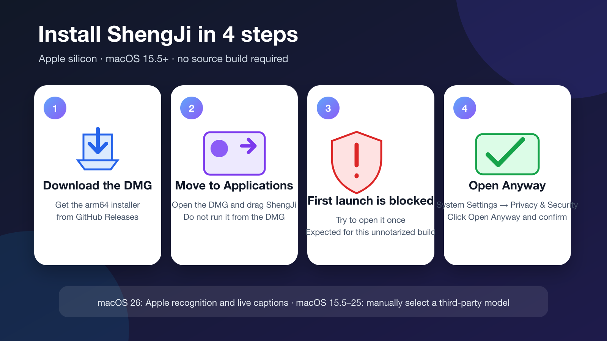

# ShengJi Download and Installation Guide

**English** | [Chinese (Simplified)](DOWNLOAD.zh-CN.md)

This guide is for people who want to install ShengJi without reading or building the source code. Installation normally takes 2–5 minutes.

[Download the latest DMG](https://github.com/maddylaneeee/ShengJi/releases/latest/download/ShengJi-macOS-arm64.dmg)



## Before you install

- Your Mac uses Apple silicon (M1, M2, M3, M4, or a newer chip). Intel Macs are not supported.
- You are running macOS 15.5 or later.
- Apple on-device recognition and floating live captions require macOS 26.
- On macOS 15.5–25, use Whisper, SenseVoice, or Parakeet by selecting a third-party model manually.

Choose Apple menu → About This Mac if you are unsure which chip or macOS version you have.

## Step 1: Download the installer

1. Open the [latest Release](https://github.com/maddylaneeee/ShengJi/releases/latest).
2. Download `ShengJi-macOS-arm64.dmg`.
3. Your browser normally saves it in Downloads.

Most users only need the DMG. The ZIP is primarily for in-app updates and advanced users; `.sha256` files verify download integrity.

## Step 2: Move ShengJi to Applications

1. Double-click `ShengJi-macOS-arm64.dmg`.
2. Drag ShengJi to Applications in the window that appears.
3. Eject the ShengJi disk image after the copy finishes.

Run the installed copy from Applications instead of leaving the app inside the DMG. This makes permissions and updates more reliable.

## Step 3: Allow the first launch

The current public build is not Apple Developer ID signed or notarized, so macOS blocks the first launch.

1. Double-click ShengJi in Applications, allow macOS to show the blocked-app message, and close the message.
2. Open System Settings → Privacy & Security.
3. Find the message saying ShengJi was blocked and click Open Anyway.
4. Confirm Open.

Only override the warning when the app came from this project's GitHub Release and you trust the project. macOS normally remembers the choice for that installed copy.

## Step 4: Choose recognition

### macOS 26

Keep Default selected to use Apple Speech Framework. Floating live captions are also available only on macOS 26 or later.

### macOS 15.5–25

Apple SpeechAnalyzer is unavailable. Select Third-Party Models on the home screen, then choose and download Whisper, SenseVoice, or Parakeet:

- Whisper supports microphone and file transcription and prefers Metal.
- SenseVoice currently supports file transcription.
- NVIDIA Parakeet currently supports file transcription.

Models can be large. Leave enough free storage and wait for the download to finish.

## Permissions

- **Microphone transcription:** allow Microphone access when first requested.
- **Mac audio:** allow Screen & System Audio Recording access when first requested.
- **Files and exports:** approve access only to locations you choose.

If you previously selected Don't Allow, reopen the relevant permission in System Settings → Privacy & Security.

## Verify SHA-256 (optional)

Each Release includes `ShengJi-macOS-arm64.dmg.sha256`. Advanced users can open Terminal, change to the download directory, and run:

```sh
shasum -a 256 -c ShengJi-macOS-arm64.dmg.sha256
```

`ShengJi-macOS-arm64.dmg: OK` means the file matches the checksum published with the Release.

## Troubleshooting

### Apple Speech is selected, but recognition cannot start

Check the macOS version. Apple SpeechAnalyzer requires macOS 26. On macOS 15.5–25, select a third-party model.

### Live captions are unavailable or produce no text

Floating live captions require macOS 26 and may first download language resources. Mac Audio also requires Screen & System Audio Recording permission.

### A third-party model remains unavailable

Confirm that the model download finished and check the network connection and free storage. You can retry from Model Management on the home screen.

### The app cannot update itself

Make sure ShengJi is in Applications and that your account can write to the installed app. You can also download the latest DMG and install over the existing copy.

### Report a problem

Open a [GitHub Issue](https://github.com/maddylaneeee/ShengJi/issues) and include, when possible:

- Mac chip;
- macOS version;
- ShengJi version;
- recognition engine and model;
- reproduction steps and the exact error message.

Return to the [English README](../README.md).
