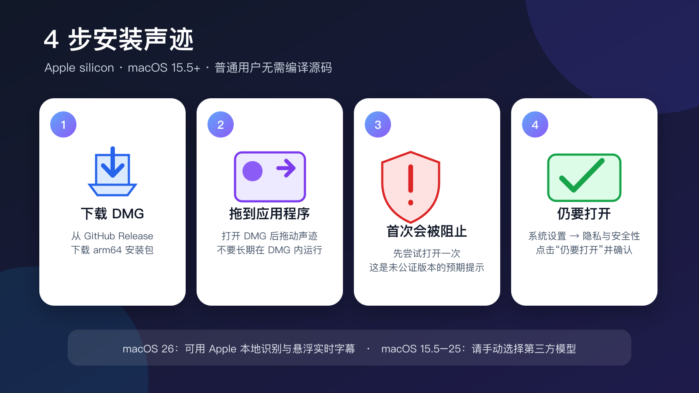

# 声迹下载与安装指南

[English](DOWNLOAD.md) | **简体中文**

本指南面向不需要阅读或编译源码的普通用户。整个安装过程通常需要 2～5 分钟。

[直接下载最新版 DMG](https://github.com/maddylaneeee/ShengJi/releases/latest/download/ShengJi-macOS-arm64.dmg)



## 安装前确认

- 你的 Mac 使用 Apple silicon（M1、M2、M3、M4 或更新芯片）。Intel Mac 暂不支持。
- 系统为 macOS 15.5 或更高版本。
- Apple 本地识别和悬浮实时字幕需要 macOS 26。
- macOS 15.5–25 可以使用 Whisper、SenseVoice 或 Parakeet；需要在首页手动选择并下载模型。

不知道自己的芯片或系统版本时，点击屏幕左上角 Apple 菜单 →“关于本机”查看。

## 第一步：下载安装包

1. 打开 [最新版 Release](https://github.com/maddylaneeee/ShengJi/releases/latest)。
2. 下载 `ShengJi-macOS-arm64.dmg`。
3. 浏览器通常会把文件保存到“下载”文件夹。

普通用户只需要 DMG。ZIP 主要用于应用内更新和高级用户；`.sha256` 文件用于校验下载完整性。

## 第二步：拖入“应用程序”

1. 双击下载好的 `ShengJi-macOS-arm64.dmg`。
2. 在出现的窗口中，把“声迹”拖到“Applications / 应用程序”。
3. 拖动完成后，可以推出名为“声迹 1.4.0”的磁盘映像。

不要直接长期运行 DMG 里的 App；从“应用程序”文件夹运行，更新和权限状态会更稳定。

## 第三步：允许首次打开

当前公开包尚未使用 Apple Developer ID 签名和公证，因此直接双击时 macOS 会阻止启动。

1. 在“应用程序”中双击“声迹”，让系统显示阻止提示，然后关闭该提示。
2. 打开“系统设置 → 隐私与安全性”。
3. 向下找到关于“声迹”被阻止的提示，点击“仍要打开”。
4. 再次确认“打开”。

只有在你从本项目 GitHub Release 下载、并且信任该项目时才应绕过警告。以后正常打开同一 App 时通常不会重复此步骤。

## 第四步：选择识别方式

### macOS 26

可以直接保留首页的“默认”选项，使用 Apple Speech Framework。悬浮实时字幕也仅在 macOS 26 及更高版本可用。

### macOS 15.5–25

Apple SpeechAnalyzer 不可用。请在首页选择“第三方模型”，然后选择并下载 Whisper、SenseVoice 或 Parakeet：

- Whisper：支持麦克风和文件转录，优先使用 Metal。
- SenseVoice：当前支持文件转录。
- NVIDIA Parakeet：当前支持文件转录。

模型可能较大，请留出足够磁盘空间并等待下载完成。

## 权限说明

- **麦克风转录：** 首次使用时允许麦克风权限。
- **Mac 声音：** 首次使用时允许“屏幕与系统音频录制”权限。
- **选择文件与导出：** 只在需要时授权读取或写入你选择的位置。

如果之前点了“不允许”，可以到“系统设置 → 隐私与安全性”中的相应项目重新开启。

## 验证 SHA-256（可选）

Release 同时提供 `ShengJi-macOS-arm64.dmg.sha256`。高级用户可以在“终端”中进入下载目录后执行：

```sh
shasum -a 256 -c ShengJi-macOS-arm64.dmg.sha256
```

看到 `ShengJi-macOS-arm64.dmg: OK` 表示下载内容与 Release 提供的校验值一致。

## 常见问题

### 首页显示 Apple Speech，但无法开始识别

先确认系统版本。Apple SpeechAnalyzer 需要 macOS 26；macOS 15.5–25 请切换到第三方模型。

### 实时字幕按钮不可用或没有结果

悬浮实时字幕需要 macOS 26，并可能需要先下载对应语言资源。使用 Mac 声音时还要授予“屏幕与系统音频录制”权限。

### 第三方模型一直不能使用

确认模型已经完整下载；检查网络和剩余磁盘空间。可在首页“模型管理”中重新下载。

### App 无法从当前位置自动更新

确认声迹位于“应用程序”文件夹，并且当前账户对该 App 有写入权限。也可以重新下载最新版 DMG 覆盖安装。

### 想反馈问题

请在 [GitHub Issues](https://github.com/maddylaneeee/ShengJi/issues) 提交问题，并尽量附上：

- Mac 芯片型号；
- macOS 版本；
- 声迹版本；
- 使用的识别引擎和模型；
- 可复现步骤及错误提示。

返回：[中文 README](../README.zh-CN.md)
