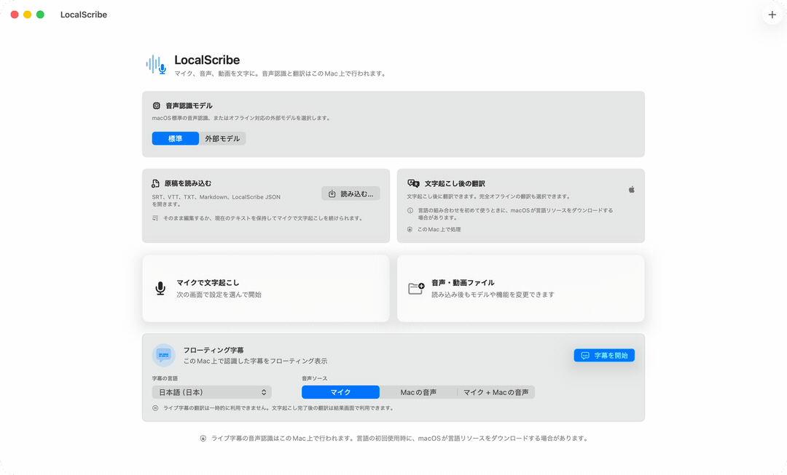
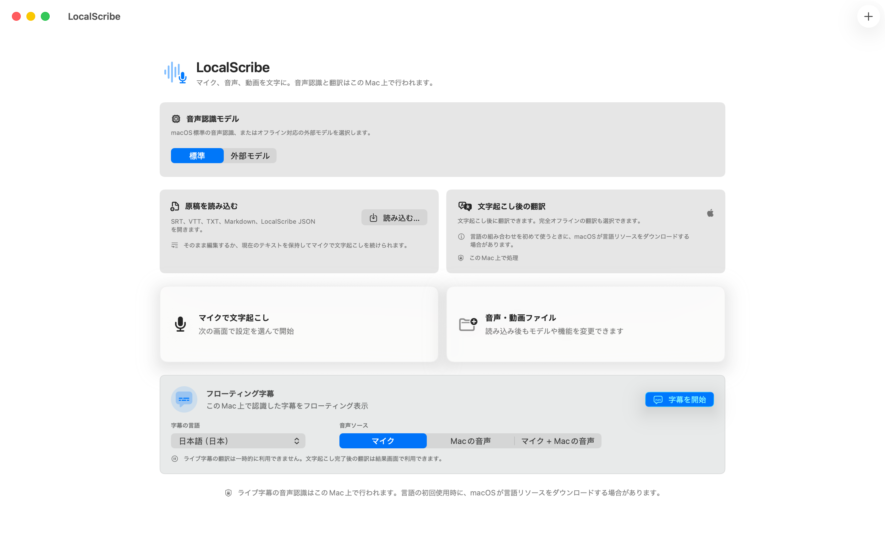
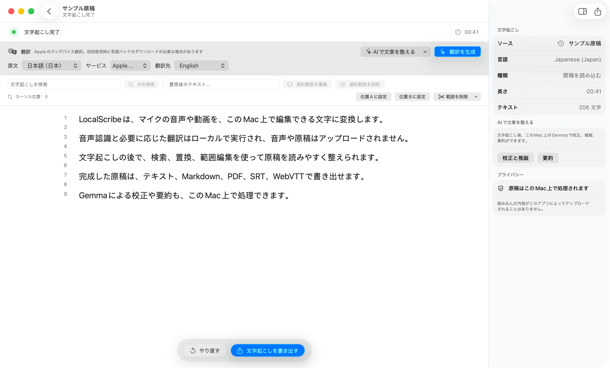

# LocalScribe

[英語](README.md) | [簡体字中国語](README.zh-CN.md) | **日本語**

[](https://support.apple.com/macos)
[](https://support.apple.com/guide/mac-help/about-this-mac-mchl3a2c2cb0/mac)
[](LICENSE)
[](https://github.com/maddylaneeee/ShengJi/actions/workflows/ci.yml)
[](https://github.com/maddylaneeee/ShengJi/releases/latest/download/LocalScribe-macOS-arm64.dmg)

**マイクの音声、音声・動画ファイル、Macで再生中の音を、そのMac上で編集可能なテキストと字幕に。**

LocalScribeは、Appleシリコン搭載Mac向けの無料・オープンソースのネイティブ文字起こしアプリです。アカウント登録は不要です。ローカル音声認識、フローティング字幕、字幕の編集と書き出し、オフライン翻訳、長時間タスクの復元、Gemma 4による文章の校正・推敲・要約を、ひとつのSwiftUIアプリにまとめています。音声、読み込んだ原稿、AIで処理する内容をアプリがアップロードすることはありません。

現在のバージョン：**1.7.0（40）** · [DMGをダウンロード](https://github.com/maddylaneeee/ShengJi/releases/latest/download/LocalScribe-macOS-arm64.dmg) · [初回起動ガイド（英語）](INSTALL.md) · [ユーザードキュメント](https://lixinchen.ca/docs/localscribe/)

> [!TIP]
> **1.7.0の変更点：マイクの元音声を保存。** 新しいマイク文字起こしで元の録音を任意に保存し、再生して文字と一緒にM4Aを書き出せます。音質は3段階です。言語変更後のメニュー、AIプロンプト編集画面、文字起こしの書き出し画面もすぐに更新されます。このバージョンでは音声合成を無効にしています。

## 動作の紹介

<picture>
  <source media="(prefers-color-scheme: dark)" srcset="Documentation/MediaKit/localscribe-demo-ja-dark.gif">
  
</picture>

実際の1.6.6アプリで撮影したホーム画面と原稿編集画面を、8秒のループで紹介します。個人情報を含まない日本語のサンプル原稿を使用しています。画像とGIFはライト・ダークの両方を用意し、閲覧テーマに応じて表示します。

> [!IMPORTANT]
> **Apple SpeechAnalyzerによる音声認識とフローティング字幕にはmacOS 26が必要です。** アプリ自体はmacOS 15.5以降に対応しています。macOS 15.5–25では、ホーム画面でWhisper、SenseVoice、Parakeetのいずれかを手動で選択してください。SenseVoiceとParakeetは現在ファイルの文字起こしのみ対応しています。

## ダウンロードとインストール

1. [最新のDMGをダウンロード](https://github.com/maddylaneeee/ShengJi/releases/latest/download/LocalScribe-macOS-arm64.dmg)します。
2. DMGを開き、LocalScribeを「アプリケーション」にドラッグします。
3. 初回起動はmacOSによってブロックされます。一度起動を試みた後、「システム設定」→「プライバシーとセキュリティ」で「このまま開く」を選び、確認画面で「開く」をクリックします。

画像付きの手順、トラブルシューティング、SHA-256の確認方法は[ダウンロードとインストールガイド（英語）](Documentation/DOWNLOAD.md)をご覧ください。

> [!WARNING]
> 公開パッケージは完全性確認用のアドホック署名のみで、Developer ID署名もAppleの公証も受けていません。このリポジトリと対象リリースを信頼できる場合のみ、システムの警告を解除してください。各リリースにはSHA-256のチェックサムファイルが付属します。

<picture>
  <source media="(prefers-color-scheme: dark)" srcset="Documentation/Screenshots/home-ja-dark.png">
  
</picture>

## Gemma 4で文字起こしを校正・推敲・要約

文字起こしが完了したら、または原稿を読み込んだら、右側のインスペクタから「AIで文章を整える」を開けます。原稿を別のAIサービスにコピーしたり、アップロードしたりせずに、このMac上で文章を整理できます。

### 差分を確認しながら校正・推敲

Gemmaは原意を保ちながら、つなぎ言葉、繰り返し、明らかな認識ミスを修正します。原文と提案文の差分が処理中に更新され、バッチの進捗、モデルの状態、このMac上での処理であることを確認できます。検証に失敗したセグメントは原文を保持します。

### 長い原稿から要点をまとめる

要約はテキストプレビューを置き換えますが、元の原稿のスナップショットを保持するため取り消せます。タスクごとに人名、専門用語、文体、要約の長さ、重点、形式などを指定でき、よく使う指示は設定に保存できます。AIの出力は必ず確認してください。

標準のGemma 4 E2B IT Q4モデルは約2.8 GBです。設定で約4.6 GBのE4Bモデルも有効にできます。モデルは必要に応じてダウンロード・検証され、llama.cppとMetalを通してMac上で実行されます。物理メモリが8 GB以下のMacではAI機能をデフォルトで無効にし、設定でメモリ警告を確認すると有効にできます。AI機能を選択したときだけGemmaを読み込み、文字起こし完了時には事前読み込みしません。Gemmaを読み込む前に、使用中の音声認識とNLLB翻訳ランタイムを解放し、タスク終了後はGemmaヘルパーも終了します。

## 主な機能

- **このMac上で処理。** 音声認識と任意の翻訳をローカルで実行し、入力音声や原稿をアプリがアップロードしません。
- **複数の入力に対応。** マイク、音声・動画ファイル、Macのシステムオーディオを文字起こしできます。通常のリアルタイム文字起こしでは、Macのシステムオーディオ、システム標準のマイク、指定した入力デバイスからひとつを選べます。
- **フローティング字幕。** macOS 26ではマイク、Macの音声、両方を混ぜた入力からライブ字幕を表示できます。
- **複数のオフラインエンジン。** Apple Speech、Metal対応whisper.cpp、SenseVoice、NVIDIA Parakeetを選べます。
- **長時間の作業に対応。** 結果の段階的な表示、追記式の復元記録、表示量を抑えた描画、一時停止・再開に対応します。
- **編集して書き出し。** 検索、置換、選択範囲の削除、範囲指定での切り詰め、翻訳ができます。TXT、Markdown、JSON、PDF、SRT、WebVTTとクリップボードへの書き出しに対応します。
- **既存の原稿を活用。** SRT、WebVTT、TXT、Markdown、LocalScribe JSONを読み込み、編集したり、末尾にマイクの文字起こしを追加したりできます。
- **ローカルAIで文章を整理。** Gemma 4で校正・推敲・要約を行い、用語や文体、重点、形式を指示できます。
- **CLI。** モデル管理、文字起こし、書き出し、翻訳をコマンドラインから実行できます。

## 原稿の編集と翻訳

<picture>
  <source media="(prefers-color-scheme: dark)" srcset="Documentation/Screenshots/transcript-editor-ja-dark.png">
  
</picture>

スクリーンショットは、バージョン1.6.6（37）の実際のmacOSアプリで、個人情報を含まない日本語のサンプル原稿を使って撮影しました。ライト・ダークともに実機画面で、Computer Useのポインタは含まれていません。アプリは英語、簡体字中国語、日本語に対応しています。

## 言語と外観

標準ではmacOSの優先言語順に従います。設定の「アプリの言語」で英語、簡体字中国語、日本語を選ぶと、システムの言語を変更せずにすぐ切り替えられます。メニューバーやライブ字幕の音声ソースも同時に更新されます。音声認識の言語メニューでは、英語とMacの言語を重複なしで「おすすめの言語」に表示します。

外観はシステムに従う設定、ライト、ダークから選べます。設定ではマイク、音声認識、システムオーディオのアクセス権も確認できます。表示言語と、音声認識・翻訳で利用できる言語は別であり、後者は選択したエンジンやモデルに依存します。

NLLB ローカル翻訳には 4 GB 以上のメモリが必要です。容量の判定には 128 MiB の誤差を許容します。Apple 翻訳は引き続き利用できます。

## 音声認識・翻訳エンジン

**利用できる場合は、Appleの標準エンジンを優先してください。** macOSのバージョンと必要な言語が対応している場合、文字起こしにはApple Speech、翻訳にはApple翻訳をおすすめします。ネイティブ環境への最適化と出力品質は、LocalScribeで利用できるサードパーティ製の文字起こし・翻訳モデルよりも明らかに優れています。

| エンジン | 用途 | 実行環境 |
| --- | --- | --- |
| Apple Speech | マイク、ファイル、ライブ字幕 | SpeechAnalyzer / SpeechTranscriber |
| Whisper | マイク、ファイル | whisper.cpp GGML、Metal、CPUへのフォールバック |
| SenseVoice | ファイル | sherpa-onnx、利用可能な場合はCore ML、CPUへのフォールバック |
| NVIDIA Parakeet | ファイル | sherpa-onnx、利用可能な場合はCore ML、CPUへのフォールバック |
| Apple翻訳 | 標準の文字起こし後翻訳 | macOS Translationフレームワーク |
| NLLB | 任意の文字起こし後翻訳 | CTranslate2 CPU/int8 |
| Gemma 4 | 原稿の校正・推敲・要約 | llama.cppとMetalによるオンデバイス推論 |

Whisperのファイル文字起こしは、アプリ側で音声を固定長に分割するのではなく、モデル内部のスライディングウインドウを使用します。長い素材では同梱のSilero VADにより無音区間をスキップしつつ、発話前後の余白と重なりを保持できます。出力のフィルタでは無音、信頼度、繰り返し、既知のハルシネーションのパターンを考慮します。

### 詳細設定

対応する外部エンジンでは、右側のインスペクタに初期状態で折りたたまれた「詳細設定」があります。Whisperではプロンプト、温度と再試行、ビームサーチまたは貪欲法、コンテキスト長、無音と信頼度のフィルタ、VAD、推論スレッド数の自動設定を調整できます。SenseVoiceとParakeetでは、それぞれのランタイムが対応する設定のみ表示します。ファイル専用・マイク専用の項目も入力に応じて表示します。

数値はキーボード、スライダ、ステッパーで入力でき、範囲を検証します。各項目にはポインタを合わせて確認できる短い説明があります。最後に使ったエンジン、モデル、詳細設定は次のタスクでも保持されます。「モデルの標準設定に戻す」は選択したエンジンのみをリセットします。

## 動作環境と現在の制限

- macOS 15.5以降、Appleシリコン（`arm64`）が必要です。Intel Macには対応していません。
- Apple SpeechAnalyzerの音声認識とライブ字幕にはmacOS 26が必要です。
- macOS 15.5–25ではWhisper、SenseVoice、Parakeetを手動で選択してください。SenseVoiceとParakeetは現在ファイルのみ対応しています。
- ライブ字幕の翻訳は現在無効です。文字起こし完了後の翻訳は利用できます。
- Gemma 4 は 8 GB 以下ではデフォルトで無効です。設定で警告を確認して有効にできます。モデルは AI 機能を選択したときだけ読み込みます。
- 公開パッケージのDeveloper ID署名とApple公証は未対応です。

マイク入力にはマイクのアクセス権、Macの音声取得には画面収録とシステムオーディオ録音のアクセス権が必要です。画面の映像は録画しません。Apple SpeechとApple翻訳は、macOSが管理する言語リソースをダウンロードする場合があります。

## ソースからビルド

XcodeとCommand Line Toolsをインストールしてください。必要なネイティブランタイムはリポジトリに含まれています。大きな音声認識モデル、NLLB、Gemma 4のモデルは選択時にのみダウンロードします。

```sh
ruby generate_project.rb

xcodebuild \
  -project LocalScribe.xcodeproj \
  -scheme LocalScribe \
  -destination 'platform=macOS,arch=arm64' \
  build
```

テストを実行するには：

```sh
xcodebuild \
  -project LocalScribe.xcodeproj \
  -scheme LocalScribe \
  -destination 'platform=macOS,arch=arm64' \
  test
```

CIではGitHubのmacOS 26 AppleシリコンランナーでテストとRelease構成の静的解析を実行します。

ローカルのパッケージスクリプトはZIPとDMGを作成し、内包する署名、アーキテクチャ、対応OS、Mach-Oファイル、アーカイブの展開、DMGのマウント、ヘルパーの起動を検証します。

```sh
./tools/package_local_release.sh
```

標準では設定済みのローカル証明書を使用します。`CODESIGN_IDENTITY=-`を指定すると、GitHub Actionsと同じアドホック署名のパッケージを作成します。`Info.plist`のバージョンと一致するタグ（例：`v1.7.0`）、またはビルド番号を含むタグ（例：`v1.7.0-build40`）をpushすると、`release-unsigned.yml`がパッケージを検証してGitHubリリースを作成します。このフローでは証明書やパスワードをGitHub Secretsに保存しません。公開配布にはDeveloper ID署名、タイムスタンプ、公証、ステープル処理が望ましい方法です。

## コマンドライン

```sh
LocalScribe.app/Contents/MacOS/LocalScribe --cli help
LocalScribe.app/Contents/MacOS/LocalScribe --cli models --json
LocalScribe.app/Contents/MacOS/LocalScribe --cli transcribe input.mp4 \
  --engine whisper --language ja_JP --format srt --output output.srt
```

## プライバシーとアップデート

LocalScribeは、音声認識に使う音声、読み込んだ原稿、Gemmaで処理する内容をアップロードしません。音声認識、翻訳、AIによる文章の整理はMac上で行います。ネットワークは、必要な音声認識・翻訳・Gemmaモデルのダウンロード、手動または自動のアップデート確認とダウンロード、外部ドキュメントを開く際に使用します。自動アップデートは設定で無効にできます。

標準では起動時と6時間ごとに最新版のGitHubリリースから`update.json`を確認します。ZIPをダウンロードし、SHA-256、バンドルID、バージョンを検証してから、アプリを置き換えて開き直す前に確認を求めます。この更新経路は、Appleの公証を受けた公開リリースの代わりになるものではありません。

## 関連ドキュメント

リンク先は日本語とは限りません。

- [ユーザードキュメント](https://lixinchen.ca/docs/localscribe/)
- [ダウンロードとインストールガイド（英語）](Documentation/DOWNLOAD.md)
- [検証・回帰テストの記録](https://lixinchen.ca/docs/localscribe/acceptance.html)
- [SherpaOnnxのビルド手順](https://lixinchen.ca/docs/localscribe/sherpa-onnx.html)
- [ロードマップ](ROADMAP.md)
- [開発への参加](CONTRIBUTING.md)
- [不具合を報告](https://github.com/maddylaneeee/ShengJi/issues)
- [紹介用の素材](Documentation/MediaKit/README.md)

## ライセンス

LocalScribeのソースコードは[MITライセンス](LICENSE)で公開しています。外部コンポーネントとモデルにはそれぞれのライセンスが適用されます。[THIRD_PARTY_NOTICES.md](THIRD_PARTY_NOTICES.md)と`Vendor`内のライセンスファイルを確認してください。

任意で利用するNLLBモデルは、配布元によりCC-BY-NC-4.0で提供されています。
