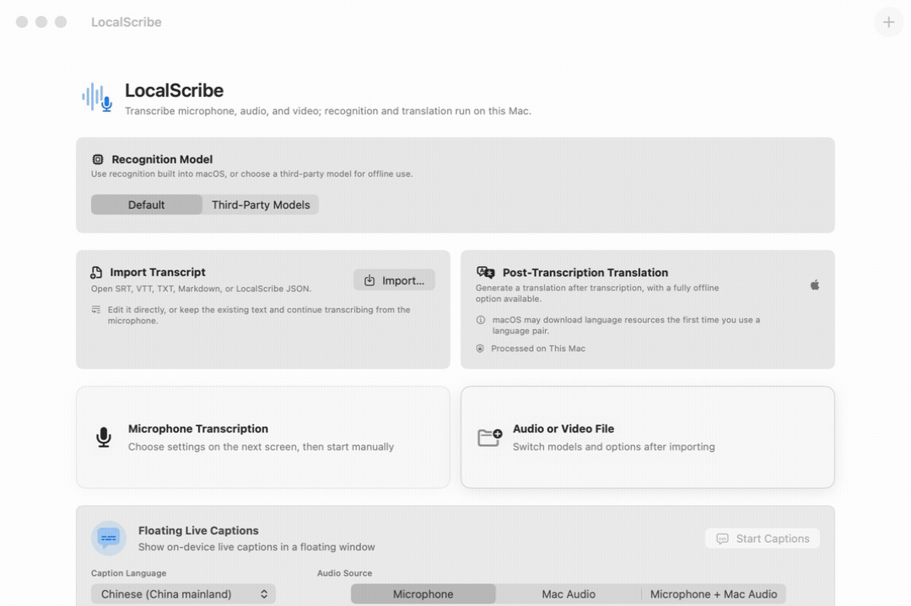
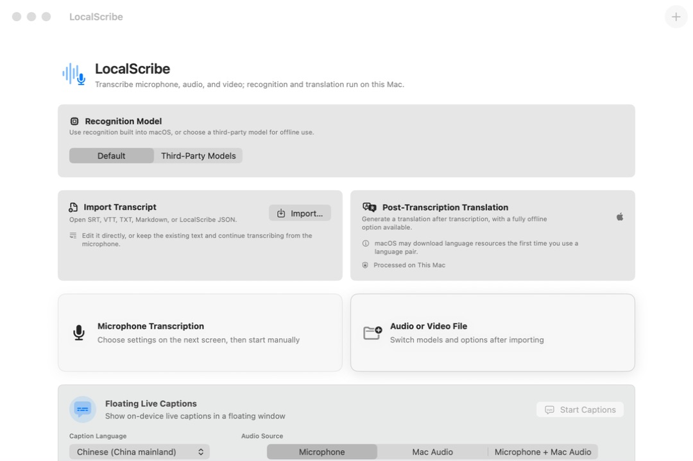
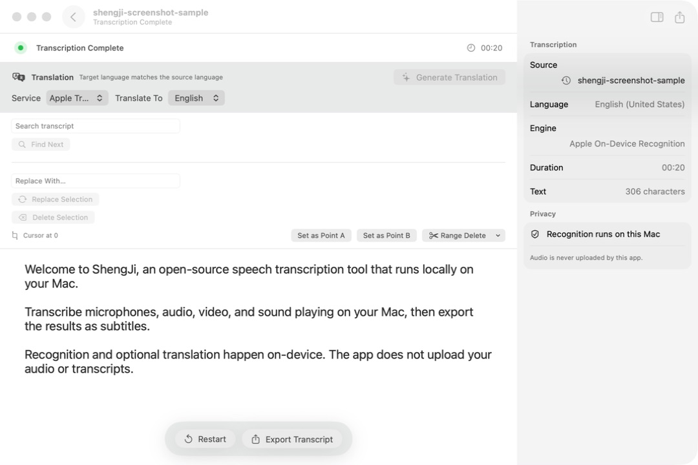

# LocalScribe

**English** | [Chinese (Simplified)](README.zh-CN.md)

[](https://support.apple.com/macos)
[](https://support.apple.com/guide/mac-help/about-this-mac-mchl3a2c2cb0/mac)
[](LICENSE)
[](https://github.com/maddylaneeee/ShengJi/actions/workflows/ci.yml)
[](https://github.com/maddylaneeee/ShengJi/releases/latest/download/LocalScribe-macOS-arm64.dmg)

**Turn microphones, media files, and the sound playing on your Mac into editable text and subtitles—locally.**

LocalScribe is a free, open-source native speech-to-text and audio/video transcription app for Apple silicon Macs, with no account required. It combines local recognition, floating live captions, subtitle editing and export, offline translation, long-task recovery, and on-device Gemma 4 transcript enhancement behind one SwiftUI interface. Audio, imported transcripts, and AI processing content are not uploaded by the app.

Current version: **1.6.5 (36)** · [Download DMG](https://github.com/maddylaneeee/ShengJi/releases/latest/download/LocalScribe-macOS-arm64.dmg) · [Non-developer download guide](Documentation/DOWNLOAD.md) · [User documentation](https://lixinchen.ca/docs/localscribe/)

> [!TIP]
> **New in 1.6.5 — choose one realtime transcription source:** Ordinary realtime transcription can use Mac System Audio, the system-default microphone, or a specific input device. File recognition releases its run-specific resources before editing and export, and long results catch up without a prolonged character-by-character tail. The existing live-caption source modes are unchanged.

## See it in action



Open LocalScribe → choose an input → get editable local text. The demo uses deterministic, non-private preview content.

> [!IMPORTANT]
> **Apple SpeechAnalyzer recognition and floating live captions require macOS 26.** The app itself supports macOS 15.5 or later. On macOS 15.5–25, manually select Whisper, SenseVoice, or Parakeet on the home screen. SenseVoice and Parakeet currently support file transcription only.

## Download and install

1. [Download the latest DMG](https://github.com/maddylaneeee/ShengJi/releases/latest/download/LocalScribe-macOS-arm64.dmg).
2. Open it and drag LocalScribe to Applications.
3. The first launch will be blocked. After trying once, open System Settings → Privacy & Security, click Open Anyway, then confirm Open.

For illustrated steps, troubleshooting, and SHA-256 verification, see the [Download and Installation Guide](Documentation/DOWNLOAD.md).

> [!WARNING]
> This build has an ad-hoc integrity signature only. It is neither Developer ID signed nor notarized by Apple. Override the warning only if you trust this repository and its Release. SHA-256 files are included with every Release.



## On-device Gemma 4 transcript enhancement (new in 1.6.4)

**Transcription is only the starting point.** After transcription or transcript import, open AI Enhancement in the right inspector to turn the result into a cleaner, deliverable document without copying it to another AI service or uploading it.

### Proofread and refine with a live diff

Gemma removes filler, repetition, and obvious transcription errors while preserving the intended meaning. Original and suggested text update in a live diff alongside batch progress, model status, and the on-device privacy indicator. Segments that fail validation keep their original text.

### Distill long transcripts into focused summaries

Summaries replace the text preview while keeping an undo snapshot of the original. Add one-time instructions for names, terminology, writing style, summary length, priorities, or format, and optionally save reusable instructions in Settings. AI output should still be reviewed.

The default Gemma 4 E2B IT Q4 model is about 2.8 GB; an optional E4B model of about 4.6 GB can be enabled in Settings. Models are downloaded on demand, verified, and run on the Mac through llama.cpp and Metal. AI Enhancement is disabled on Macs with 6 GB of physical memory or less. Before loading Gemma, LocalScribe releases its active recognition and NLLB translation runtimes; the Gemma helper exits when the task finishes.

## Why LocalScribe?

- **Local by default.** Recognition and optional translation run on the Mac; input audio and imported transcripts are not uploaded by the app.
- **More than dictation.** Use microphone input, media files, Mac audio, floating live captions, transcript editing, recovery, and subtitle export in one workflow.
- **Multiple offline engines.** Choose Apple Speech, whisper.cpp with Metal, SenseVoice, or NVIDIA Parakeet instead of being locked to one model family.
- **Long-task workflow.** Progressive results, append-only recovery journals, bounded transcript rendering, pause/resume, and resumable sessions are designed for long recordings.
- **Editable deliverables.** Import, search, replace, trim, translate, and export TXT, Markdown, JSON, PDF, SRT, or WebVTT.
- **On-device AI transcript enhancement.** Use Gemma 4 to proofread, refine, or summarize a transcript, with custom instructions for terminology, style, focus, and format.
- **System-aware interface.** English and Simplified Chinese switch automatically with the Mac language preference, using an extensible localization structure.

## Transcript editing and translation



The screenshots are from version 1.6.0 of the real macOS app and use an isolated profile with non-private test transcript content. LocalScribe includes complete English and Simplified Chinese interfaces.

## Languages

LocalScribe follows the preferred language order in macOS by default. You can also switch the app immediately between English and Simplified Chinese in Settings without changing the system language; the menu bar and live-caption source controls update at the same time. Recognition-language menus place English and the Mac's language in a deduplicated Recommended Languages section. Settings also provide System, Light, and Dark appearance choices, plus current microphone, speech-recognition, and system-audio permission status.

## Recognition and translation engines

| Engine | Use | Runtime |
| --- | --- | --- |
| Apple Speech | Microphone, files, live captions | SpeechAnalyzer / SpeechTranscriber |
| Whisper | Microphone and files | whisper.cpp GGML, Metal with CPU fallback |
| SenseVoice | Files | sherpa-onnx, Core ML eligible path with CPU fallback |
| NVIDIA Parakeet | Files | sherpa-onnx, Core ML eligible path with CPU fallback |
| Apple Translation | Default post-transcription translation | macOS Translation framework |
| NLLB | Optional post-transcription translation | CTranslate2 CPU/int8 |
| Gemma 4 | Transcript proofreading, refinement, and summarization | On-device llama.cpp inference with Metal |

Whisper file transcription uses the model's internal sliding windows rather than fixed, non-overlapping application chunks. For longer media, the bundled Silero VAD can skip silence while retaining speech padding and overlap. Output filtering considers silence, confidence, repetition, and known hallucination patterns.

### Advanced transcription controls

For supported third-party engines, the right inspector includes an Advanced section that is collapsed when a task opens. Whisper exposes a model prompt, temperature and fallback controls, beam or greedy search settings, context length, silence and confidence filters, VAD, and a guarded automatic thread policy. SenseVoice and Parakeet expose the options their local runtimes actually support. File-only and microphone-only settings appear only for the matching source.

Numeric options support both direct keyboard entry and sliders or steppers, with range validation and short hover explanations. The app remembers the last engine, model, and advanced configuration for the next task; Restore Model Defaults resets only the selected engine.

## Highlights

- Apple Speech live captions for microphone, Mac audio, or mixed input on macOS 26.
- whisper.cpp Metal inference with bundled Silero VAD and automatic CPU fallback.
- Downloadable Whisper, SenseVoice, and Parakeet model choices.
- Adaptive progressive text display for file and microphone transcription.
- Editable transcripts with search, replacement, selection deletion, and range trimming.
- SRT, WebVTT, TXT, Markdown, and LocalScribe JSON import.
- TXT, Markdown, JSON, PDF, SRT, WebVTT, and clipboard export.
- Apple Translation by default, with optional local NLLB INT8 translation.
- Append-only session journals and recovery snapshots for long-running work.
- A command-line interface for models, transcription, export, and translation.

## Requirements and current limitations

- macOS 15.5 or later.
- Apple silicon (`arm64`); Intel Macs are not supported.
- Apple SpeechAnalyzer recognition and live captions require macOS 26.
- On macOS 15.5–25, select Whisper, SenseVoice, or Parakeet manually. SenseVoice and Parakeet currently support file transcription only.
- Live-caption translation is currently disabled; post-transcription translation remains available.
- Gemma 4 AI Enhancement requires more than 6 GB of physical memory; models are downloaded on demand and run locally.
- Public Developer ID signing and Apple notarization are still pending.

Microphone input requires microphone permission. Capturing Mac audio requires Screen & System Audio Recording permission. Apple Speech and Apple Translation may download language assets managed by macOS.

## Build from source

Install Xcode and its Command Line Tools. The repository includes the native runtimes required by the app; large recognition, NLLB, and Gemma 4 models are downloaded only when selected.

```sh
ruby generate_project.rb

xcodebuild \
  -project LocalScribe.xcodeproj \
  -scheme LocalScribe \
  -destination 'platform=macOS,arch=arm64' \
  build
```

Run the test suite:

```sh
xcodebuild \
  -project LocalScribe.xcodeproj \
  -scheme LocalScribe \
  -destination 'platform=macOS,arch=arm64' \
  test
```

CI runs the tests and Release static analysis on GitHub's macOS 26 Apple silicon runner.

The local packaging script creates ZIP and DMG artifacts and validates nested signatures, architectures, deployment targets, embedded Mach-O files, archive extraction, DMG mounting, and helper startup:

```sh
./tools/package_local_release.sh
```

By default it uses the configured local certificate. Set `CODESIGN_IDENTITY=-` to make the same ad-hoc package produced by GitHub Actions. Pushing a tag that matches the version in `Info.plist` (for example, `v1.6.1`) runs `release-unsigned.yml`, verifies the package, and creates the GitHub Release without storing a certificate or password in GitHub Secrets. Developer ID signing, timestamping, notarization, and stapling remain the preferred public distribution path.

## CLI

```sh
LocalScribe.app/Contents/MacOS/LocalScribe --cli help
LocalScribe.app/Contents/MacOS/LocalScribe --cli models --json
LocalScribe.app/Contents/MacOS/LocalScribe --cli transcribe input.mp4 \
  --engine whisper --language en_US --format srt --output output.srt
```

## Privacy and updates

LocalScribe does not upload recognition audio, imported transcripts, or content processed by Gemma. Recognition, translation, and AI transcript enhancement run on the Mac. Network access is used for on-demand recognition, translation, and Gemma model downloads, automatic or manual update checks and downloads, and opening external documentation. Automatic updates can be disabled in Settings.

The built-in updater checks at launch and every six hours by default, reads `update.json` from the latest GitHub Release, downloads its ZIP, verifies SHA-256, checks the bundle identifier and version, and asks before replacing and relaunching the app. This update path is not a substitute for a notarized public release.

## Documentation

- [User documentation](https://lixinchen.ca/docs/localscribe/)
- [Download and Installation Guide](Documentation/DOWNLOAD.md)
- [Acceptance and regression notes](https://lixinchen.ca/docs/localscribe/acceptance.html)
- [SherpaOnnx build notes](https://lixinchen.ca/docs/localscribe/sherpa-onnx.html)
- [Roadmap](ROADMAP.md)
- [Contributing](CONTRIBUTING.md)
- [Report an issue](https://github.com/maddylaneeee/ShengJi/issues)
- [Media and recommendation kit](Documentation/MediaKit/README.md)

## License

LocalScribe source code is available under the [MIT License](LICENSE). Third-party components and models retain their original licenses; see [THIRD_PARTY_NOTICES.md](THIRD_PARTY_NOTICES.md) and the license files under `Vendor`.

The optional NLLB model is distributed upstream under CC-BY-NC-4.0.
