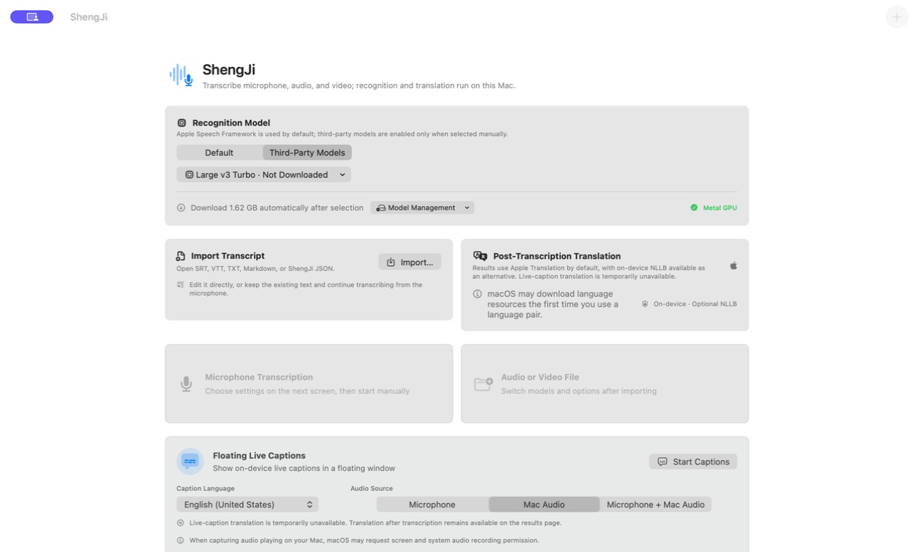
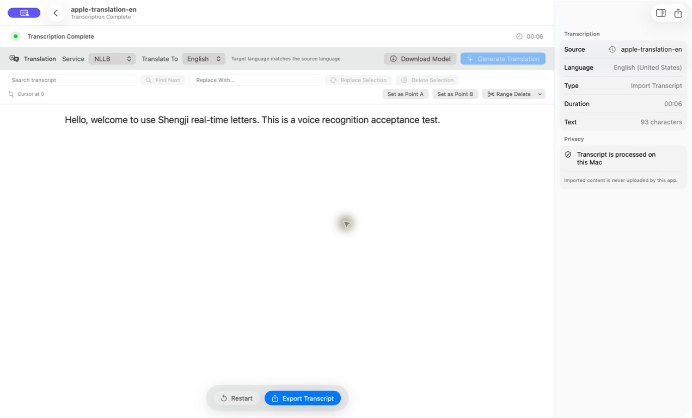
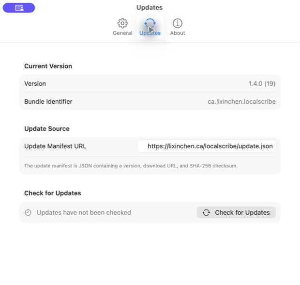

# 声迹 · LocalScribe

[English](README.md) | **简体中文**

[](https://support.apple.com/macos)
[](https://support.apple.com/guide/mac-help/about-this-mac-mchl3a2c2cb0/mac)
[](LICENSE)
[](https://github.com/maddylaneeee/ShengJi/actions/workflows/ci.yml)

声迹是一款原生 macOS 本地语音转录应用。它可以转录麦克风、音频或视频文件以及 Mac 正在播放的声音，并提供本地翻译、稿件编辑、字幕导入导出和可恢复的长任务工作流。

当前源码版本：**1.4.0（19）**

文档：<https://lixinchen.ca/docs/localscribe/>

## 界面预览








## 项目状态

| 项目 | 状态 |
| --- | --- |
| 源码 | 持续开发，可从源码构建 |
| 自动化 | Debug 测试与 Release 静态分析 |
| 支持平台 | Apple silicon，macOS 15.5+ |
| Apple 本地识别与实时字幕 | macOS 26+ |
| Intel Mac | 暂不支持 |
| 公开安装包 | Developer ID 签名与 Apple 公证版本尚未发布 |

目前 GitHub 不提供正式签名的二进制安装包。仓库中的本机打包脚本和独立更新通道用于开发验收，不代表已经通过 Apple 公证的公开发行版。希望试用的开发者可按下方步骤从源码构建。

## 功能

- 默认使用 Apple Speech Framework；只有用户主动选择时才启用第三方模型，并记忆上次选择。
- Whisper 通过 whisper.cpp、Metal 和内置 Silero VAD 处理长音频；Metal 不可用时自动回退 CPU。
- SenseVoice 与 NVIDIA Parakeet 通过 sherpa-onnx 运行，并自动优先尝试具备 Core ML/ANE 调度资格的路径，失败时回退 CPU。
- 实时字幕固定使用 Apple 本地识别，支持麦克风、Mac 声音和混合输入，不暴露第三方模型选项。
- 实时字幕保留模型的连续增量输出；悬浮窗按阅读方向从左到右追加文字并跟随尾部滑动。窗口以约 15 Hz 的离散步进更新，避免 60 Hz 屏幕上的持续动画拖影。
- Apple Speech 没有输出逗号或句号时也不会强制截成短句，显示窗口仍会持续向前推进。
- Apple 完成一个识别段落后，悬浮窗会把已完成内容作为上下文保留约 2 秒；后续模型结果仍会立即追加并继续滑动，不会冻结，也不会因逗号、句号或最终段落边界瞬间清空。
- 文件与麦克风转录支持节奏自适应的逐字显示，降低大段结果一次跳入造成的卡顿。
- 暂停或完成后可搜索、替换、删除所选文本，并通过两个编辑节点删除前部、后部或节点之间的内容。
- 可导入 SRT、WebVTT、TXT、Markdown 和声迹 JSON，随后直接编辑或保留稿件继续麦克风转录。
- 转录后默认使用 Apple Translation，也可选择本机 NLLB INT8 模型。
- 支持 TXT、Markdown、JSON、PDF、SRT、WebVTT 导出及复制到剪贴板。
- 支持追加式恢复记录和应用内 ZIP 更新；识别音频与导入稿件不会由应用上传。

## 引擎

| 引擎 | 用途 | 运行方式 |
| --- | --- | --- |
| Apple Speech | 麦克风、文件、实时字幕 | SpeechAnalyzer / SpeechTranscriber |
| Whisper | 麦克风、文件 | whisper.cpp GGML，Metal → CPU |
| SenseVoice | 文件 | sherpa-onnx，Core ML 优先 → CPU |
| NVIDIA Parakeet | 文件 | sherpa-onnx，Core ML 优先 → CPU |
| Apple Translation | 默认转录后翻译 | macOS Translation Framework |
| NLLB | 可选转录后翻译 | CTranslate2 CPU/int8 |

Whisper 文件输入由 whisper.cpp 自动推进窗口，不由应用固定切成互不重叠的小片段。12 秒以上音频会在适合时启用内置 Silero VAD v6.2.0，并保留语音边缘和重叠。幻觉过滤结合静音区域、置信度、重复片段和已知口播模板，避免删除真实语音中的正常致谢。

## 系统要求

- macOS 15.5 或更高版本。
- Apple silicon（arm64）。
- Apple SpeechAnalyzer 本地识别及实时字幕需要 macOS 26。
- 麦克风输入需要麦克风权限。
- Mac 声音输入需要“屏幕与系统音频录制”权限。
- Apple Translation 首次使用某个语言组合时可能由 macOS 下载语言资源。

在 macOS 15.5–25 上，Apple SpeechAnalyzer 不可用，需要在首页手动选择 Whisper、SenseVoice 或 Parakeet。SenseVoice 和 Parakeet 当前仅支持文件转录。

## 构建

需要 Xcode 及其 Command Line Tools。仓库包含当前应用所需的本机运行时；大型识别与 NLLB 模型由应用按需下载，不提交到 Git。

```sh
ruby generate_project.rb

xcodebuild \
  -project LocalScribe.xcodeproj \
  -scheme LocalScribe \
  -destination 'platform=macOS,arch=arm64' \
  build
```

运行测试：

```sh
xcodebuild \
  -project LocalScribe.xcodeproj \
  -scheme LocalScribe \
  -destination 'platform=macOS,arch=arm64' \
  test
```

CI 使用 GitHub 官方 `macos-26` Apple Silicon runner 执行测试和 Release 静态分析。

本机发布脚本会生成经过签名层级、架构、最低系统版本、嵌套 Mach-O 和解压启动检查的 ZIP：

```sh
./tools/package_local_release.sh
```

该脚本默认不覆盖已安装应用；本机验收时可显式设置 `INSTALL_LOCAL_COPY=1`。公开分发仍应使用 Developer ID、时间戳、公证和 stapling，不应把本机签名产物当作正式公开发行包。

## CLI

```sh
声迹.app/Contents/MacOS/LocalScribe --cli help
声迹.app/Contents/MacOS/LocalScribe --cli models --json
声迹.app/Contents/MacOS/LocalScribe --cli transcribe input.mp4 \
  --engine whisper --language zh_CN --format srt --output output.srt
```

## 应用内更新

默认更新清单：<https://lixinchen.ca/localscribe/update.json>

更新器会下载 ZIP、校验 SHA-256、核对 Bundle ID、版本和最低系统要求，并在用户确认后替换应用。更新站点与 GitHub 源码仓库相互独立。

## 隐私与文档

- 使用说明：<https://lixinchen.ca/docs/localscribe/>
- 验收记录：<https://lixinchen.ca/docs/localscribe/acceptance.html>
- SherpaOnnx 构建说明：<https://lixinchen.ca/docs/localscribe/sherpa-onnx.html>
- GitHub：<https://github.com/maddylaneeee/ShengJi>

声迹的识别和可选翻译流程在本机完成。网络仅用于用户主动触发的模型下载、应用更新及打开外部文档。

## 许可证

项目源码使用 [MIT License](LICENSE)。第三方组件和模型保留各自许可证；详见 [THIRD_PARTY_NOTICES.md](THIRD_PARTY_NOTICES.md) 以及 `Vendor` 中随组件保存的许可证文件。NLLB 模型为可选下载项，其上游许可为 CC-BY-NC-4.0。
