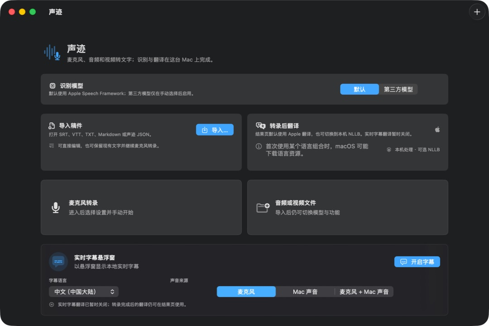
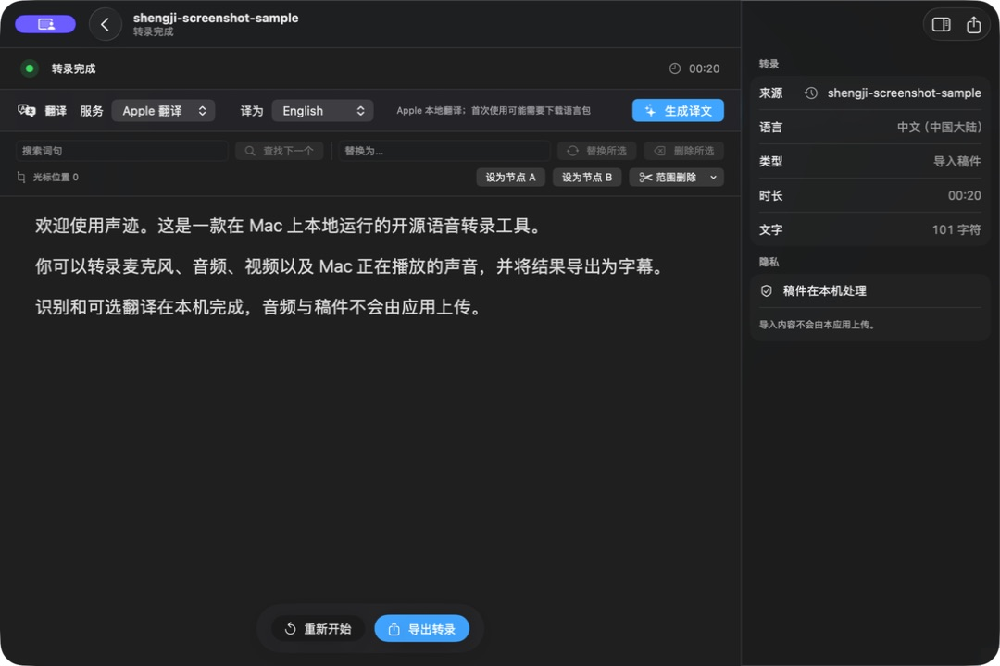

# ShengJi（LocalScribe，中文名“声迹”）

[English](README.md) | **简体中文**

[](https://support.apple.com/macos)
[](https://support.apple.com/guide/mac-help/about-this-mac-mchl3a2c2cb0/mac)
[](LICENSE)
[](https://github.com/maddylaneeee/ShengJi/actions/workflows/ci.yml)
[](https://github.com/maddylaneeee/ShengJi/releases/latest/download/ShengJi-macOS-arm64.dmg)

**把麦克风、音视频文件和 Mac 正在播放的声音，在本机转成可编辑文字与字幕。**

ShengJi 是一款面向 Apple silicon Mac 的免费、开源原生转录应用，无需注册账号。它把本地识别、悬浮实时字幕、稿件编辑、离线翻译、字幕导入导出和长任务恢复整合在一个 SwiftUI 界面中。识别音频和导入稿件不会由应用上传。

当前版本：**1.4.0（19）** · [下载 DMG](https://github.com/maddylaneeee/ShengJi/releases/latest/download/ShengJi-macOS-arm64.dmg) · [非开发者下载指南](Documentation/DOWNLOAD.zh-CN.md) · [使用文档](https://lixinchen.ca/docs/localscribe/)

> [!IMPORTANT]
> **Apple SpeechAnalyzer 本地识别和悬浮实时字幕需要 macOS 26。** App 本身支持 macOS 15.5+；在 macOS 15.5–25 上，请在首页手动选择 Whisper、SenseVoice 或 Parakeet。SenseVoice 和 Parakeet 当前仅支持文件转录。

## 界面预览





截图来自真实的 1.4.0 macOS App，使用隔离配置和非私人示例稿件制作。

## 适合做什么

- **给 Mac 声音加实时字幕：** 捕获 Mac 正在播放的声音，以悬浮窗显示本地字幕。
- **转录会议与素材：** 导入音频或视频，使用 Apple Speech、Whisper、SenseVoice 或 NVIDIA Parakeet。
- **整理可交付稿件：** 搜索、替换、删除、范围裁剪，并导出 TXT、Markdown、JSON、PDF、SRT 或 WebVTT。
- **继续已有内容：** 导入 SRT、WebVTT、TXT、Markdown 或声迹 JSON，也可在原稿后继续麦克风转录。
- **在本机翻译：** 转录后默认使用 Apple Translation，也可下载 NLLB INT8 模型。
- **处理长录音：** 逐步显示结果，保存追加式恢复记录，并支持暂停、恢复和重新开始。

## 下载与安装

1. [下载最新版 DMG](https://github.com/maddylaneeee/ShengJi/releases/latest/download/ShengJi-macOS-arm64.dmg)。
2. 打开 DMG，把“声迹”拖到“应用程序”。
3. 第一次尝试打开时，macOS 会阻止启动。进入“系统设置 → 隐私与安全性”，找到声迹提示并点击“仍要打开”，然后确认“打开”。

完整图文步骤、常见问题和 SHA-256 校验方法见：[下载与安装指南](Documentation/DOWNLOAD.zh-CN.md)。

> [!WARNING]
> 当前公开包只有 ad-hoc 完整性签名，没有 Apple Developer ID 签名，也未经过 Apple 公证。只有在你信任本仓库及对应 Release 时才应绕过系统警告。每个 Release 同时提供 SHA-256 校验文件。

## 系统要求与功能边界

| 项目 | 要求或状态 |
| --- | --- |
| 处理器 | Apple silicon（arm64）；暂不支持 Intel Mac |
| App 最低系统 | macOS 15.5 |
| Apple Speech 文件/麦克风识别 | macOS 26+ |
| 悬浮实时字幕 | macOS 26+，固定使用 Apple 本地识别 |
| macOS 15.5–25 | 手动选择 Whisper、SenseVoice 或 Parakeet |
| SenseVoice / Parakeet | 当前仅支持文件转录 |
| 实时字幕翻译 | 当前关闭；转录完成后的翻译仍可使用 |
| 麦克风 | 需要麦克风权限 |
| Mac 声音 | 需要“屏幕与系统音频录制”权限 |

Apple Speech 和 Apple Translation 首次使用某些语言时，可能由 macOS 下载对应语言资源。第三方模型只在用户主动选择后下载和启用。

## 识别与翻译引擎

| 引擎 | 用途 | 运行方式 |
| --- | --- | --- |
| Apple Speech | 麦克风、文件、实时字幕 | SpeechAnalyzer / SpeechTranscriber |
| Whisper | 麦克风、文件 | whisper.cpp GGML，Metal → CPU |
| SenseVoice | 文件 | sherpa-onnx，Core ML 可用路径 → CPU |
| NVIDIA Parakeet | 文件 | sherpa-onnx，Core ML 可用路径 → CPU |
| Apple Translation | 默认转录后翻译 | macOS Translation Framework |
| NLLB | 可选转录后翻译 | CTranslate2 CPU/int8 |

Whisper 文件转录使用模型内部滑动窗口；较长素材会在适合时启用内置 Silero VAD v6.2.0。过滤逻辑综合静音、置信度、机械重复和已知幻觉模板，同时尽量保留真实说出的结尾语句。

## 隐私与联网行为

声迹不会上传识别音频或导入稿件。网络仅用于用户主动触发的模型下载、应用更新检查，以及打开外部文档。NLLB 和第三方识别模型会在使用前明确显示下载状态。

## 从源码构建

需要 Xcode 及 Command Line Tools。仓库已包含 App 所需的本机运行时；大型识别模型和 NLLB 模型按需下载，不提交到 Git。

```sh
ruby generate_project.rb

xcodebuild \
  -project LocalScribe.xcodeproj \
  -scheme LocalScribe \
  -destination 'platform=macOS,arch=arm64' \
  build
```

运行测试：

```sh
xcodebuild \
  -project LocalScribe.xcodeproj \
  -scheme LocalScribe \
  -destination 'platform=macOS,arch=arm64' \
  test
```

CI 使用 GitHub 的 macOS 26 Apple silicon runner 执行测试和 Release 静态分析。`./tools/package_local_release.sh` 会创建 ZIP 与 DMG，并检查签名层级、架构、最低系统版本、嵌套 Mach-O、解压启动和 DMG 挂载。

## CLI

```sh
声迹.app/Contents/MacOS/LocalScribe --cli help
声迹.app/Contents/MacOS/LocalScribe --cli models --json
声迹.app/Contents/MacOS/LocalScribe --cli transcribe input.mp4 \
  --engine whisper --language zh_CN --format srt --output output.srt
```

## 文档与反馈

- [非开发者下载与安装指南](Documentation/DOWNLOAD.zh-CN.md)
- [使用说明](https://lixinchen.ca/docs/localscribe/)
- [验收与回归记录](https://lixinchen.ca/docs/localscribe/acceptance.html)
- [SherpaOnnx 构建说明](https://lixinchen.ca/docs/localscribe/sherpa-onnx.html)
- [路线图](ROADMAP.md)
- [参与贡献](CONTRIBUTING.md)
- [提交问题](https://github.com/maddylaneeee/ShengJi/issues)
- [媒体与推荐资料包](Documentation/MediaKit/README.zh-CN.md)

## 许可证

项目源码使用 [MIT License](LICENSE)。第三方组件和模型保留各自许可证，详见 [THIRD_PARTY_NOTICES.md](THIRD_PARTY_NOTICES.md) 和 `Vendor` 中的许可证文件。可选 NLLB 模型由上游以 CC-BY-NC-4.0 提供。
